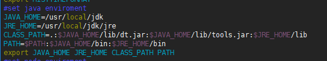
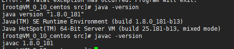

# 下载安装包
```
wget http://download.Oracle.com/otn-pub/java/jdk/8u60-b27/jdk-8u60-linux-x64.tar.gz
```
# 解压安装包
```
tar xf jdk-8u60-linux-x64.tar.gz -C /usr/local/
```
# 安装
```
cd /usr/local/
ln -sv jdk1.8.0_60 jdk
```
# 配置环境变量
```
vim /etc/profile
```
``` js
#set java enviroment 
JAVA_HOME=/usr/local/jdk
JRE_HOME=/usr/local/jdk/jre
CLASS_PATH=.:$JAVA_HOME/lib/dt.jar:$JAVA_HOME/lib/tools.jar:$JRE_HOME/lib
PATH=$PATH:$JAVA_HOME/bin:$JRE_HOME/bin
export JAVA_HOME JRE_HOME CLASS_PATH PATH
```

``` js
./etc/profile  
//重读此文件，让变量生效
```
# 查看是否安装成功
```
java -version
javac -version
```

