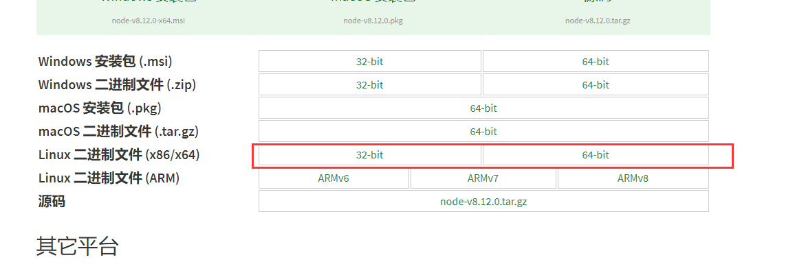
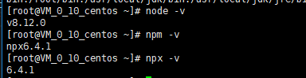

## node安装
---
 1. 下载node二进制文件
    
 
    ```js
    wget https://nodejs.org/dist/v8.12.0/node-v8.12.0-linux-x64.tar.xz
    ```
    
 2. 解压
    ```js 
    // 解压
    tar -xvf node-v8.12.0-linux-x64.tar.xz
    // 重命名
    mv node-v8.12.0-linux-x64.tar.xz /usr/local/node-v8.12.0
    ```
 3. 配置环境变量
    ```js
    // 修改环境变量
    vim /etc/profile
    ```
    ```js
    # set node path
    PATH=$PATH:/usr/local/node-v8.12.0/bin
    export PATH
    ```
    ```js
    // 让环境变量生效
    source /etc/profile
    ```
    ```js
    // 查看是否生效
    echo $PATH
    ```
  3. 或者这中方式设置环境变量
   ``` js
   //以使用 ln 命令来设置软连接：
    ln -s /usr/local/node-v8.12.0/bin/node /usr/local/bin
    ln -s /usr/local/node-v8.12.0/bin/npx /usr/local/bin
    ln -s /usr/local/node-v8.12.0/bin/npm /usr/local/bin
   ```
 4. 看到这里已经成功了<br/>
   
---