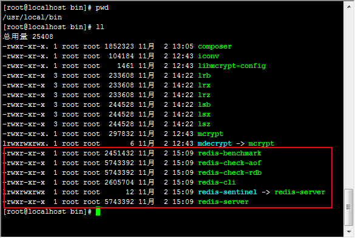
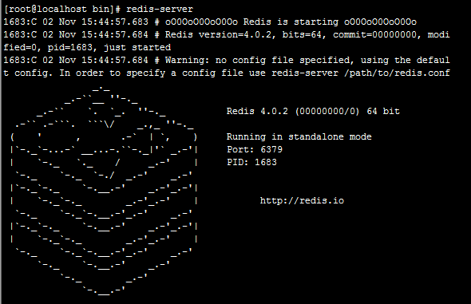
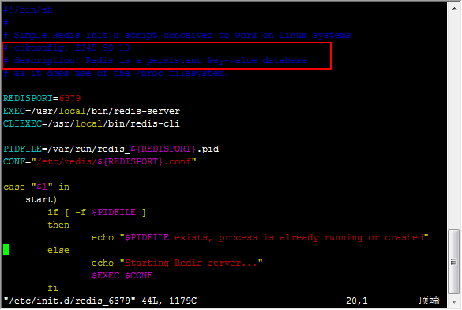
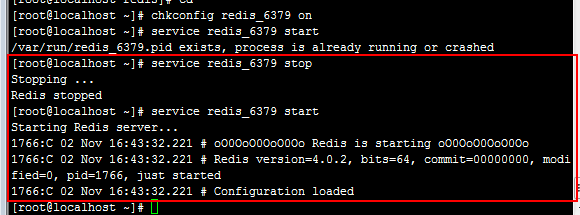

# 下载安装包
``` 
wget http://download.redis.io/releases/redis-4.0.2.tar.gz
```

# 解压安装包
```
tar xzf redis-4.0.2.tar.gz
cd redis-4.0.2
make
make install
```
> Redis没有其他外部依赖，安装过程很简单。编译后在Redis源代码目录的src文件夹中可以找到若干个可执行程序，安装完后，在/usr/local/bin目录中可以找到刚刚安装的redis可执行文件。

如下图:

# 启动和停止Redis
>直接运行redis-server即可启动Redis
```
// 进入redis->src目录
redis-server
```

# 通过初始化脚本启动Redis
>在Redis源代码目录的utils文件夹中有一个名为`redis_init_script`的初始化脚本文件。需要配置Redis的运行方式和持久化文件、日志文件的存储位置。步骤如下：
1. 配置初始化脚本
    >首先将初始化脚本复制到/etc/init.d 目录中，文件名为 redis_端口号，其中端口号表示要让Redis监听的端口号，客户端通过该端口连接Redis。然后修改脚本第6行的REDISPORT变量的值为同样的端口号。
2. 建立以下需要的文件夹。
    | 目录名 | Value |
    |:-|:-:|
    | /etc/redis | 存放Redis的配置文件 |
    | /var/redis/端口号 | 存放Redis的持久化文件 |
3. 修改配置文件
    >首先将配置文件模板（redis-4.0.2/redis.conf）复制到/etc/redis 目录中，以端口号命名（如“6379.conf”），然后按照下表对其中的部分参数进行编辑。
    
    参数|	值|	说明
    |:-|-|:-:|
    daemonize|	yes	|使Redis以守护进程模式运行
    pidfile	|/var/run/redis_端口号.pid|	设置Redis的PID文件位置
    port|	端口号|	设置Redis监听的端口号
    dir	|/var/redis/端口号	|设置持久化文件存放位置
    requirepass | 密码 | 设置密码需要重启
    >现在也可以使用下面的命令来启动和关闭Redis了
    ```
    /etc/init.d/redis_6379 start
    /etc/init.d/redis_6379 stop
    ```
    
    **`重中之重`** 让Redis随系统自动启动，这还需要对Redis初始化脚本进行简单修改，执行命令：
    ```
    vim /etc/init.d/redis_6379
    ```
    在打开的redis初始化脚本文件头部第四行的位置，追加下面两句
   ```
    # chkconfig: 2345 90 10 
    # description: Redis is a persistent key-value database
    ```
    追加后效果如下：
    
    上图红色框中就是追加的两行注释，添加完毕后进行保存，即可通过下面的命令将Redis加入系统启动项里了
    ``` js
    //设置开机执行redis脚本
    chkconfig redis_6379 on
    ```
    >通过上面的操作后，以后也可以直接用下面的命令对Redis进行启动和关闭了，如下
    ```
    service redis_6379 start
    service redis_6379 stop
    ```
    
    >经过上面的部署操作后，系统重启，Redis也会随着系统自动启动，并且上面的步骤里也配置了Redis持久化，下次启动系统或Redis时，有缓存数据不丢失的好处。
# 停止Redis
>考虑到 Redis 有可能正在将内存中的数据同步到硬盘中，强行终止 Redis 进程可能会导致数据丢失。正确停止Redis的方式应该是向Redis发送SHUTDOWN命令，方法为：
```
redis-cli SHUTDOWN
```

>当Redis收到SHUTDOWN命令后，会先断开所有客户端连接，然后根据配置执行持久化，最后完成退出。
Redis可以妥善处理 SIGTERM信号，所以使用 kill Redis 进程的 PID也可以正常结束Redis，效果与发送SHUTDOWN命令一样。